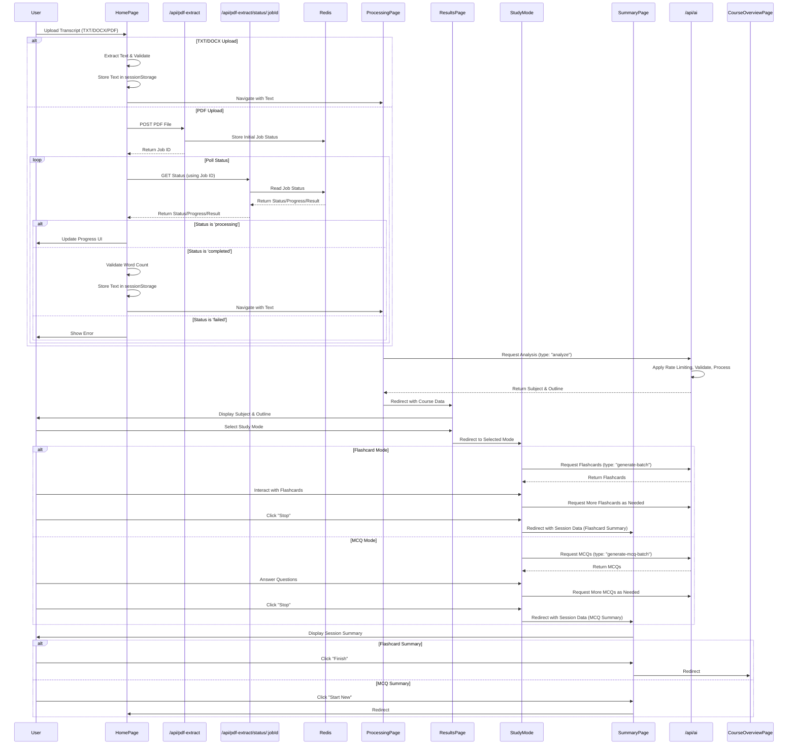
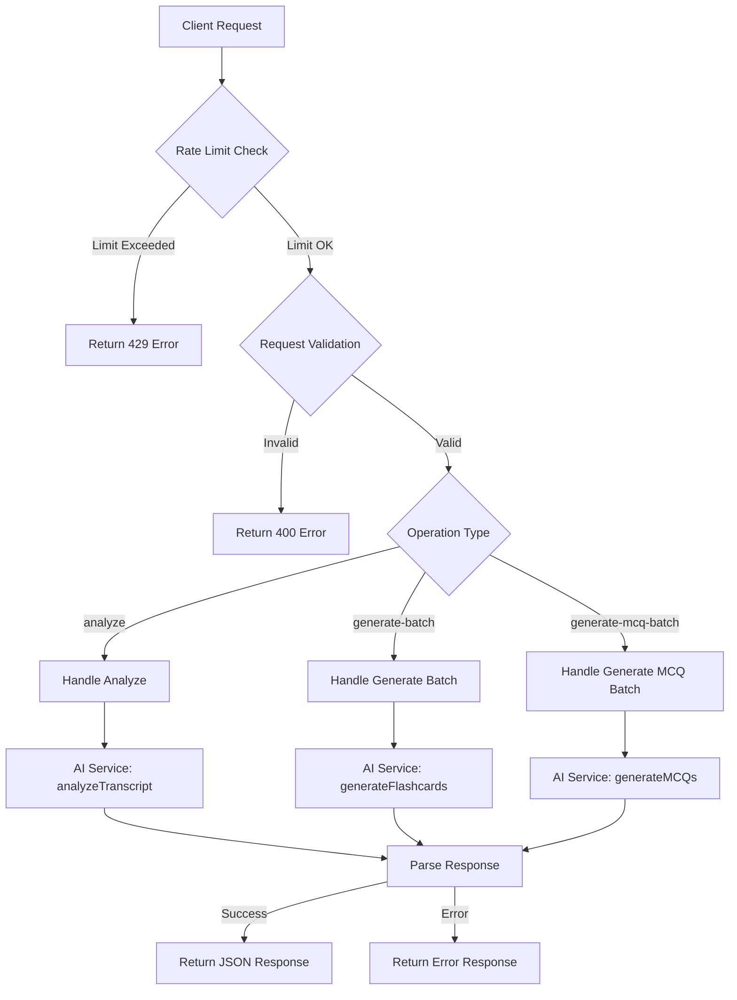
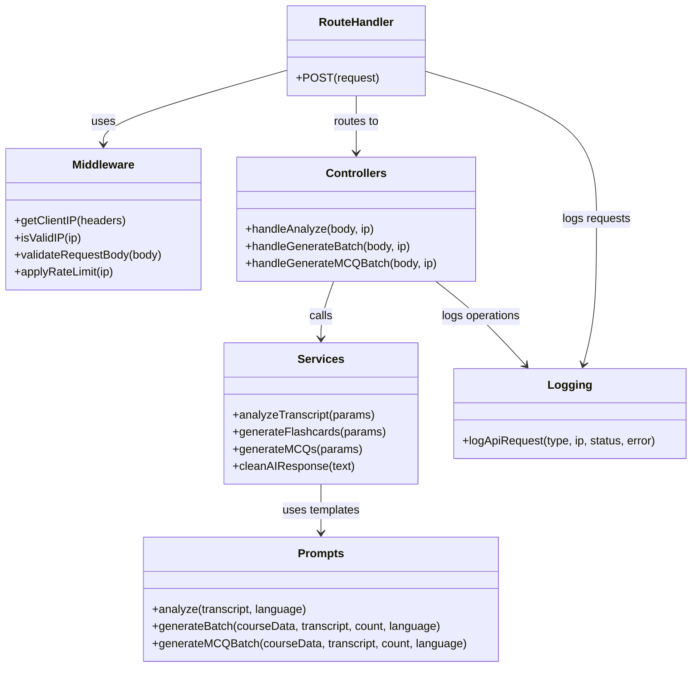

# AI Flashcard Generator: Architecture Diagram

This document provides a detailed visual representation of the application's architecture using Mermaid diagrams.

## System Architecture

```mermaid
graph TD
    subgraph "Client Browser"
        UI[React UI Components]
        Storage[Session Storage]
        Interactions[User Interactions]
    end

    subgraph "Next.js API Routes"
        AIRoute["/api/ai Route Handler"]
        Middleware[Middleware Layer (AI)]
        Controllers[Controller Layer (AI)]
        Services[Service Layer (AI)]
        Prompts[Prompt Templates (AI)]
        PdfExtractRoute["/api/pdf-extract (POST)"]
        PdfStatusRoute["/api/pdf-extract/status/[jobId] (GET)"]
    end

    subgraph "External Services"
        AI[OpenAI/Mistral API]
        Redis[(Redis / Upstash)]
    end

    UI --> |Upload/Interact| AIRoute
    UI --> |PDF Upload| PdfExtractRoute
    UI --> |Poll Status| PdfStatusRoute

    PdfExtractRoute --> |Store Job Status| Redis
    PdfExtractRoute --> |Use pdf-parse| PdfExtractRoute
    PdfStatusRoute --> |Read Job Status| Redis
    Redis --> |Return Status| PdfStatusRoute

    AIRoute --> |Validate| Middleware
    Middleware --> |Route Request| Controllers
    Controllers --> |Process| Services
    Services --> |Use Templates| Prompts
    Services --> |Make Request| AI
    AI --> |Response| Services
    Services --> |Parse Response| Controllers
    Controllers --> |Format Response| AIRoute
    AIRoute --> |JSON Response| UI

    PdfStatusRoute --> |Return Text/Status| UI
    UI --> |Store Data| Storage
    Storage --> |Retrieve Data| UI
    Interactions --> |Trigger Actions| UI
```

## User Flow Diagram



## API Request Flow



## Component Structure



## Note on Viewing Mermaid Diagrams

These diagrams are written in Mermaid syntax. To view them:

1. Use a Markdown editor that supports Mermaid (like VS Code with the Markdown Preview Mermaid Support extension)
2. Copy the diagram code to an online Mermaid editor like [Mermaid Live Editor](https://mermaid.live/)
3. Or view this document in GitHub, which natively supports Mermaid diagrams
