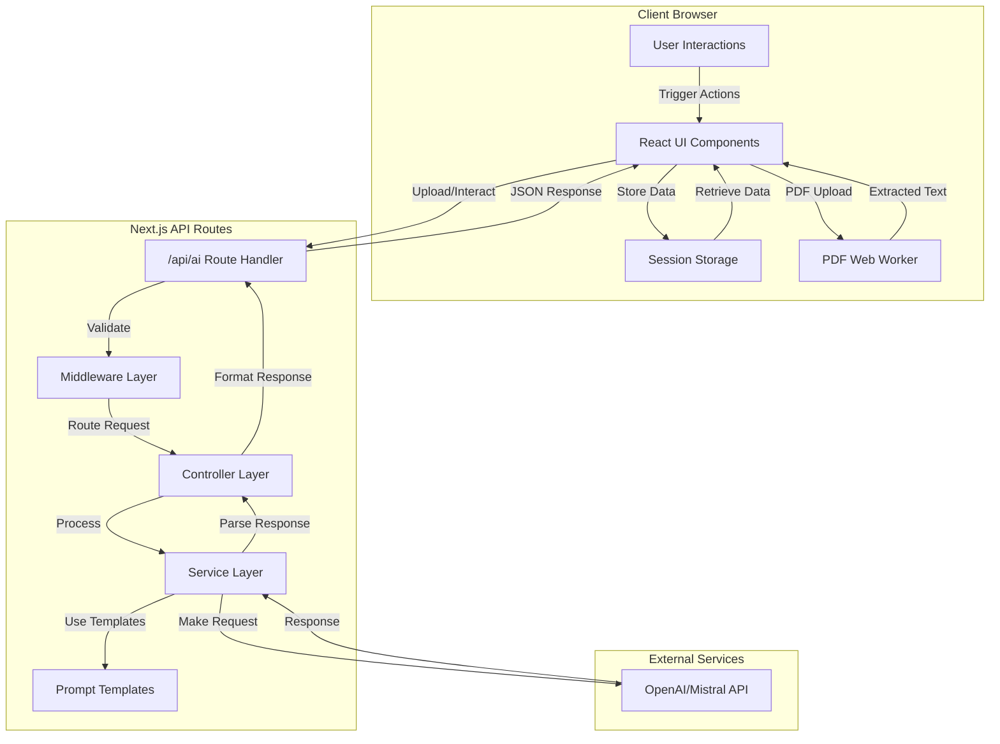
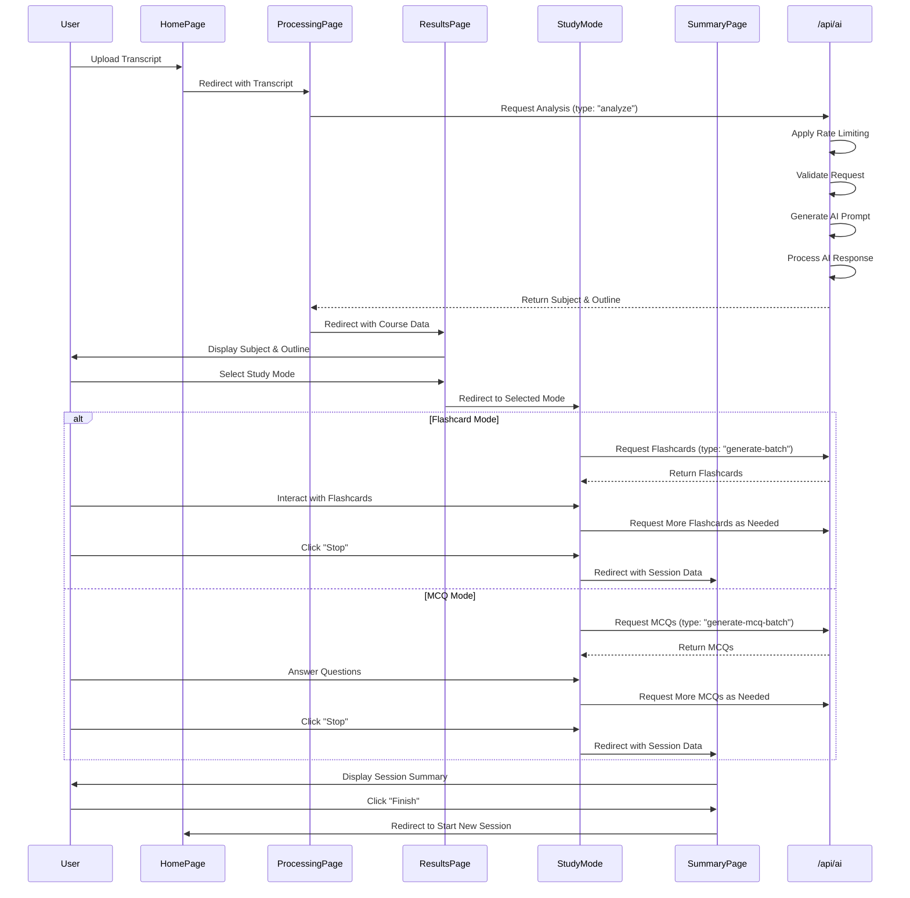
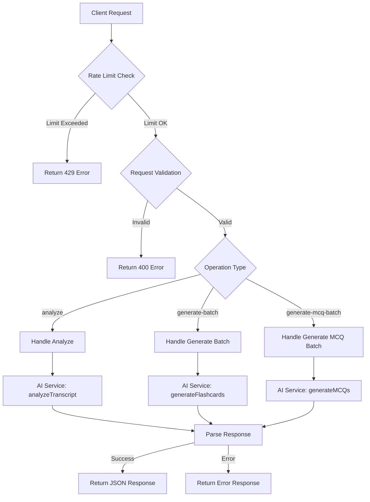
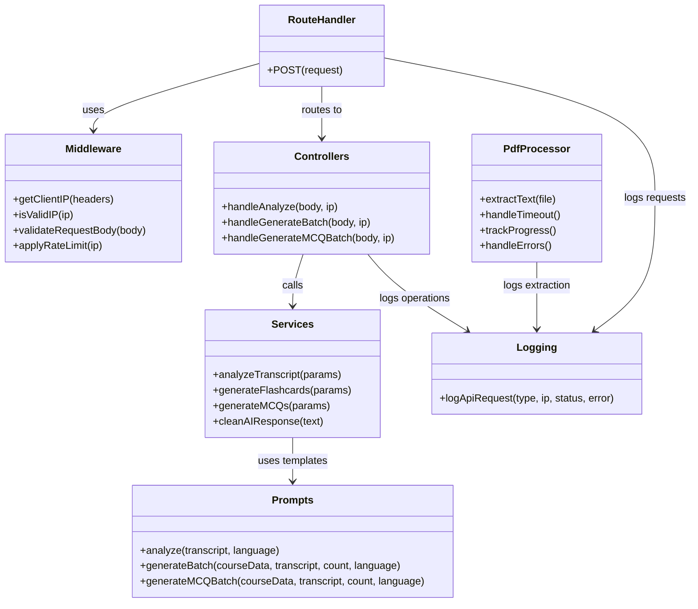

# AI Flashcard Generator: Architecture Diagram

This document provides a detailed visual representation of the application's architecture using Mermaid diagrams.

## System Architecture

## User Flow Diagram

## API Request Flow

## Component Structure

## Note on Viewing Mermaid Diagrams

These diagrams are written in Mermaid syntax. To view them:

1. Use a Markdown editor that supports Mermaid (like VS Code with the Markdown Preview Mermaid Support extension)
2. Copy the diagram code to an online Mermaid editor like [Mermaid Live Editor](https://mermaid.live/)
3. Or view this document in GitHub, which natively supports Mermaid diagrams
